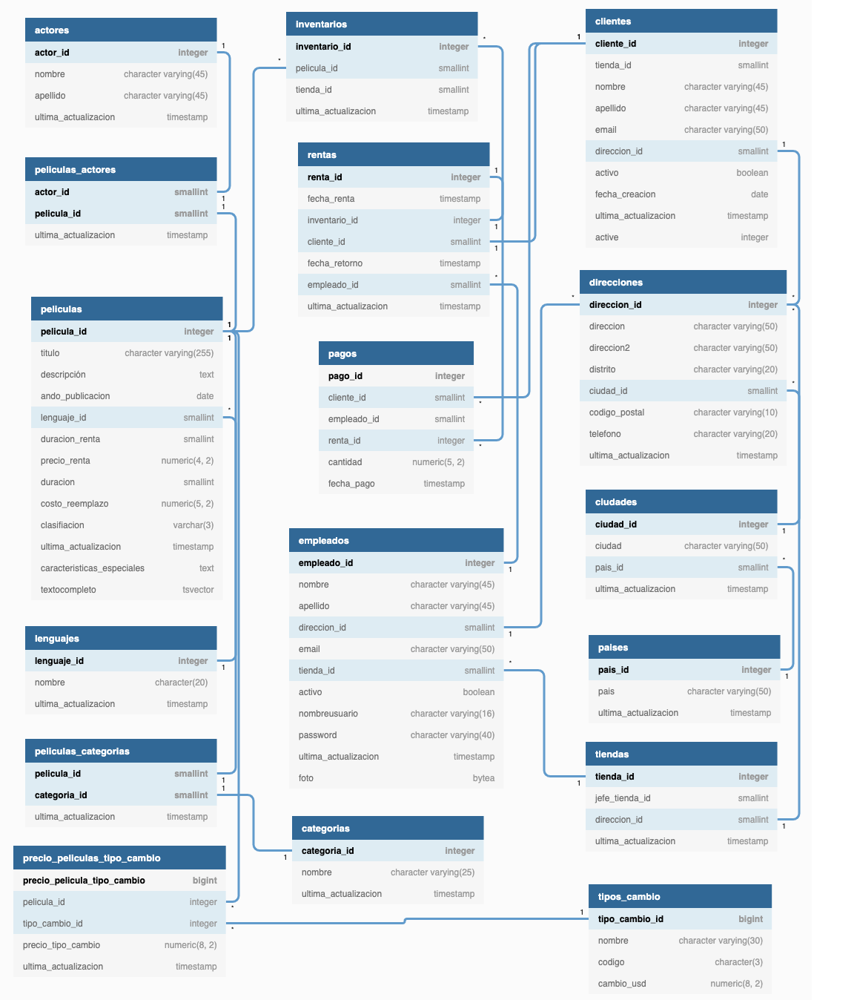

# Curso práctico
## Diagrama identidad relación
Cada base datos cuenta con una estructura independiene y funcional, la mayor parte de las veces, para cada aplicación o proyecto en cuestión, pero una herramienta o recurso que nos podría ayudar es apoyarnos de un siagrama identidad-relación.



## Agregación de datos
En este apartado usamos información

Obtener el precio mayor de renta de las películas dadas
```sql
select max(precio_renta)
from peliculas;
```
Obtener el suma de peliculas por clasificación
```sql
select clasificacion, count(*)
from películas
group by clasificacion
```
Promedio de renta
```sql
select clasificacion, avg(duracion_renta) as promedioderenta
from peliculas
group by clasificacion
order by promedioderenta desc;
```
## Pensar en como presentar los datos
Como presentar los datos puede ser un reto importante para personas con un perfil altamente ténico lo que es bueno para muchas cosas, pero presentar los datos nos ayuda a entender el publico a quien nos dirigimos y las características 
Respuesta:

Los puntos clave:

- Importancia de la presentación de datos: Más allá de extraer datos, es crucial saber cómo contar la historia detrás de ellos y presentarlos adecuadamente a diferentes audiencias.

- Planeación: Antes de extraer datos, planifica cómo los presentarás y qué mensaje deseas transmitir.

- Herramientas de visualización: Considera diferentes tipos de gráficos (líneas, barras, pastel) según la información que quieras destacar.

- Contexto de los datos: Comprender la temporalidad y las tendencias es vital para comunicar eficazmente los resultados.

- Impacto en la empresa: La presentación efectiva puede influir en decisiones y estrategias dentro de una organización.

## Trabajando con objetos

PostgreSQL permite almacenar y manipular datos JSON de manera eficiente, lo cual es útil para manejar estructuras de datos flexibles y complejas. A continuación, se detallan las ventajas de usar el tipo de dato JSON, cómo crear una tabla con un campo JSON, cómo insertar y consultar datos en formato JSON, y las diferencias entre el almacenamiento de JSON como cadenas y como objetos.

### Ventajas del Tipo de Dato JSON en PostgreSQL

El tipo de dato JSON permite almacenar datos en un formato flexible y estructurado sin una estructura fija de columnas. Esto resulta ventajoso para:

- **Estructuras dinámicas**: Ideal para almacenar datos con diferentes esquemas, como configuraciones personalizadas o información de clientes.
- **Interoperabilidad**: JSON es un formato ampliamente usado en aplicaciones web y APIs, lo cual facilita la integración.
- **Manipulación directa de datos**: PostgreSQL ofrece funciones y operadores específicos para manipular datos JSON, lo cual facilita operaciones avanzadas sin necesidad de procesar datos fuera de la base de datos.

### Crear una Tabla con un Campo JSON

Para crear una tabla con un campo JSON, se define una columna con el tipo `JSON` o `JSONB`. `JSONB` es una versión optimizada que permite realizar operaciones más eficientes.

```sql
CREATE TABLE clientes (
    id SERIAL PRIMARY KEY,
    nombre VARCHAR(50),
    datos JSONB
);ON
```
Ejemplo 2 

```sql
create table ordenes(
id serial not null primary key,
info json not null
)
```
### Ejemplo de Inserción y Consulta de Datos JSON en PostgreSQL

Este ejemplo muestra cómo insertar datos en una columna de tipo JSON y cómo extraer información usando sentencias `SELECT` en PostgreSQL. Vamos a trabajar con una tabla `ordenes` que tiene una columna llamada `info`, donde se almacena información en formato JSON.

#### Insertar Datos en Formato JSON

La siguiente instrucción `INSERT` agrega tres registros en la tabla `ordenes`, donde la columna `info` contiene datos estructurados en JSON.

```sql
INSERT INTO ordenes (info)
VALUES
   (
      '{ "cliente": "David Sanchez", "items": {"producto": "Biberón","cantidad": 24}}'
   ),
   (
      '{ "cliente": "Edna Cardenas", "items": {"producto": "Carro de juguete","cantidad": 1}}'
   ),
   (
      '{ "cliente": "Israel Vazquez", "items": {"producto": "Tren de juguete","cantidad": 2}}'
   );
```

Ejemplo 1: Seleccionar el Nombre del Cliente

La siguiente consulta utiliza el operador -> para extraer el valor de "cliente" en cada registro  en formato json

``` sql
SELECT
   info -> 'cliente' AS cliente --Lo que nos regresa es un obejto json
FROM
   ordenes;
```
Ejemplo 2: Seleccionar el Nombre del Cliente en formato string mediante la modificación del operador
```sql
SELECT
   info ->> 'cliente' AS cliente --Lo que nos regrsa es un texto
FROM
   ordenes;
```
Ejemplo 3, usando una sentencia where, maneja de manera casi nativa datos json
```sql
SELECT
   info ->> 'cliente' AS cliente
FROM
   ordenes
WHERE
   info -> 'items' ->> 'producto' = 'Biberón'
```
## Agregar objetos
dentro de la parte de objetos json es un reto para la base de datos, porque tiene que buscar dentro de la cadena json tanto cómo tu le indiques, es un trabajo complejo y no lo hace vastanbte simple el uso de plpgsql

Funciones casteadas
En PostgreSQL, CAST es una función que convierte un valor de un tipo de dato a otro. Esto es útil cuando necesitas realizar operaciones o comparaciones que requieren que los valores estén en el mismo tipo de dato o cuando deseas presentar datos en un formato específico.
```sql
select
	min(
    cast(
        info -> 'items' ->>'cantidad' as integer -- lo optiene como una cadena con la doble flechita y luyego con es as se convierte en entero para que lo pueda usar min()
    )),
	max(
    cast(
        info -> 'items' ->>'cantidad' as integer -- lo optiene como una cadena con la doble flechita y luyego con es as se convierte en entero para que lo pueda usar max()
    )),
	avg(
    cast(
        info -> 'items' ->>'cantidad' as integer -- lo optiene como una cadena con la doble flechita y luyego con es as se convierte en entero para que lo pueda usar avg()
    )),
	sum(
    cast(
        info -> 'items' ->>'cantidad' as integer -- lo optiene como una cadena con la doble flechita y luyego con es as se convierte en entero para que lo pueda usar sum()
    ))
from ordenes;
```
## Common table expressions
### Expresiones de Tabla Comunes (CTEs) en PostgreSQL

Las **expresiones de tabla comunes** (CTEs, por sus siglas en inglés) en PostgreSQL son una herramienta poderosa para organizar y optimizar consultas. Permiten dividir una consulta compleja en partes más manejables, mejorando la legibilidad, la reutilización y el rendimiento.

#### ¿Qué es una CTE?

Una **CTE** es una subconsulta que se define al inicio de una consulta `SELECT` usando la cláusula `WITH`. Se comporta como una tabla temporal que solo es visible dentro del contexto de la consulta que la define. Las CTEs se pueden utilizar para:

- Dividir consultas complejas en partes más manejables.
- Evitar la repetición de subconsultas en la misma consulta.
- Reducir la sobrecarga de memoria.
- Mejorar la legibilidad y mantenimiento del código.

#### Sintaxis Básica
```sql
WITH nombre_cte AS (
   -- Definición de la subconsulta
   SELECT columnas
   FROM tabla
   WHERE condición
)
SELECT *
FROM nombre_cte;
```
### Ejemplo de CTE Recursiva en PostgreSQL para Jerarquía de Empleados

Este ejemplo muestra cómo usar una Expresión de Tabla Común (CTE) recursiva en PostgreSQL para construir una jerarquía de empleados. La CTE recursiva permite generar niveles de jerarquía para cada empleado, comenzando desde el director general y avanzando a través de los niveles jerárquicos.

#### Código SQL Explicado

```sql
WITH RECURSIVE jerarquia_empleados AS (
    -- Punto de inicio de la recursión: selecciona al director general (nivel 1)
    SELECT empleado_id, nombre, puesto, jefe_id, 1 AS nivel
    FROM empleados
    WHERE jefe_id IS NULL

    UNION ALL

    -- Parte recursiva: busca empleados que reportan a cada jefe en el nivel anterior
    SELECT e.empleado_id, e.nombre, e.puesto, e.jefe_id, j.nivel + 1
    FROM empleados e
    INNER JOIN jerarquia_empleados j ON e.jefe_id = j.empleado_id
)
SELECT *
FROM jerarquia_empleados
ORDER BY nivel, empleado_id;
```
## Window Function

Las Window Functions son herramientas en SQL que nos permiten realizar cálculos en una fila específica de la consulta en relación a un conjunto de filas (llamado "ventana") definido por la cláusula `OVER`. Esto es útil para hacer cálculos como sumas acumulativas, promedios, máximos, mínimos, y otros, sin necesidad de agregar los resultados en una sola fila o grupo.

### Ventajas de las Window Functions

- **Relación por ventanas**: Permiten analizar la fila actual en el contexto de un rango de otras filas, sin colapsar los resultados en un grupo.
- **Optimización**: Agilizan y simplifican las consultas al evitar subconsultas complejas o cálculos adicionales.
- **Flexibilidad**: Son especialmente útiles en análisis de series de tiempo, estadísticas acumulativas y cálculos basados en ordenamientos específicos.

### Ejemplo de Uso

Un ejemplo común de una Window Function es el cálculo de la suma acumulativa de ventas en una tabla:

```sql
SELECT 
    fecha, 
    ventas, 
    SUM(ventas) OVER (ORDER BY fecha) AS ventas_acumuladas
FROM ventas_mensuales;
```
Una forma de entender una window funtion es una referenciación de un caso particular en el conjunto derivado de una consulta compleja.

## Particiones

La clase se centró en las **particiones** en PostgreSQL, una técnica avanzada de diseño de bases de datos que permite dividir una tabla en segmentos lógicos. Esta estrategia mejora la eficiencia en las consultas y es especialmente útil para manejar grandes volúmenes de datos.

## ¿Qué son las particiones?

Las particiones permiten dividir una tabla grande en varias tablas más pequeñas, conocidas como **particiones**. Cada partición puede ser tratada como una tabla independiente, lo que facilita la gestión y el acceso a los datos.

### Beneficios de las particiones

1. **Mejora en el rendimiento de consultas**:
   - Las consultas pueden ser más rápidas al trabajar solo con las particiones relevantes en lugar de toda la tabla. PostgreSQL puede descartar particiones que no son necesarias para una consulta, reduciendo así el tiempo de respuesta.

2. **Mantenimiento más fácil**:
   - Las operaciones de mantenimiento, como la eliminación de datos antiguos o el archivo de datos, se pueden realizar a nivel de partición. Esto puede resultar en una gestión más eficiente y menos disruptiva.

3. **Escalabilidad**:
   - Las particiones permiten a las bases de datos escalar mejor, distribuyendo la carga de trabajo y facilitando el crecimiento de la base de datos al manejar grandes volúmenes de datos.

### Casos de uso típicos

Las particiones son particularmente útiles en situaciones como:
- **Registros de ventas**: Donde los datos pueden dividirse por año o mes.
- **Datos de sensores**: Para manejar grandes volúmenes de datos temporales que se generan continuamente.
- **Historial de auditoría**: Donde los registros antiguos pueden archivarse y eliminarse fácilmente.

### Consideraciones y limitaciones

A pesar de sus beneficios, las particiones no son adecuadas para todas las tablas. Algunos puntos a tener en cuenta incluyen:

- **Claves únicas**: Las particiones pueden complicar la implementación de claves únicas en una tabla. Esto se debe a que cada partición puede necesitar su propia restricción de unicidad, lo que puede hacer que las búsquedas y las actualizaciones sean más complejas.

- **Decisiones de particionamiento**: Es esencial evaluar el caso de uso específico y las consultas previstas para decidir si la implementación de particiones es ventajosa. Un mal diseño de particiones puede llevar a un rendimiento deficiente en lugar de mejorar la eficiencia.

## Ejemplo de partición

```sql
CREATE TABLE ventas (
    id SERIAL PRIMARY KEY,
    fecha DATE NOT NULL,
    monto NUMERIC NOT NULL
) PARTITION BY RANGE (fecha);

CREATE TABLE ventas_2023 PARTITION OF ventas FOR VALUES FROM ('2023-01-01') TO ('2023-12-31');
CREATE TABLE ventas_2024 PARTITION OF ventas FOR VALUES FROM ('2024-01-01') TO ('2024-12-31');

